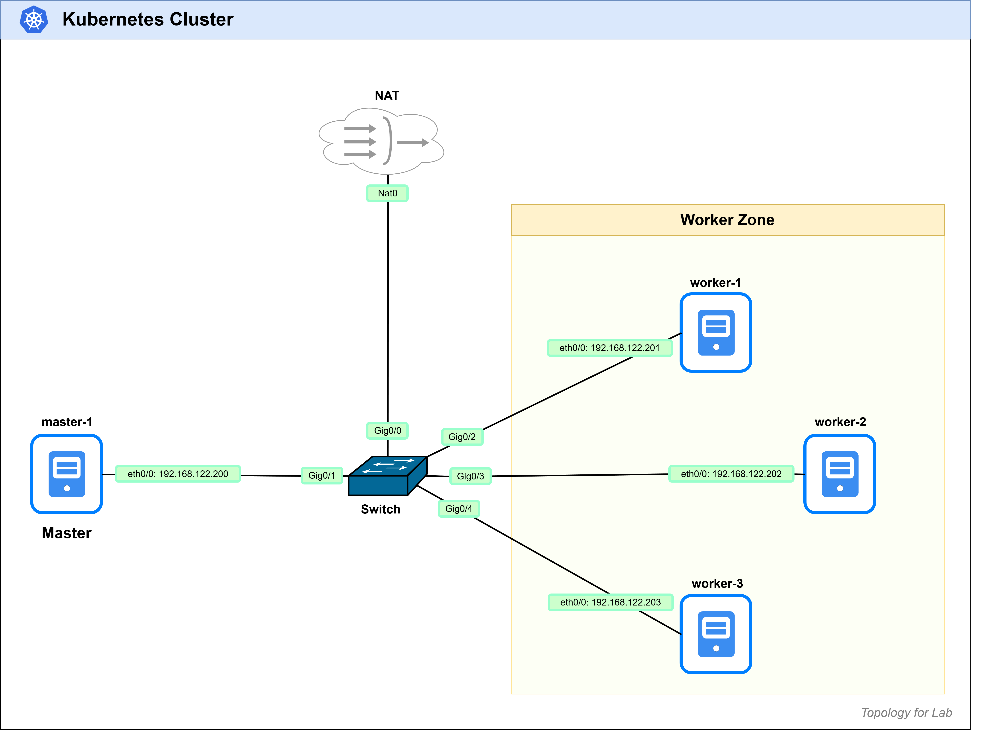

# Kubernetes Provisioning with Ansible

An Ansible-based automation for deploying a Native Kubernetes Cluster (Kubeadm) on servers. This project automates the installation and cluster initialization joining.

## Highlights

- Automated installation Kubernetes using Ansible playbooks.
- Automated joining of worker nodes to cluster.

## Simple Topology for this Lab

<div align="center">
    
</div>

## Tech Stack

- Ansible
- uv (Python Package Manager), Make sure you have `uv` installed. see: https://docs.astral.sh/uv/getting-started/installation/#installation-methods

## Setup and Installation

1. Clone the repository:
2. Create and activate virtual environment:

   ```bash
   # Create
   uv venv

   # Activate venv in Linux (bash)
   source .venv/bin/activate

   # Activate venv in Windows (powershell)
   .venv\Scripts\activate
   ```

3. Install dependencies:
   - `uv` read `dependencies` in `pyproject.toml` to install.

   ```bash
   uv sync
   ```

4. Install Ansible collections:
   - define `-p` to install in local `./collections` directory.

   ```bash
   ansible-galaxy collection install -r requirements.yml -p ./collections
   ```

5. Set Ansible config file:
   - Running `ansible --version` to show config file path. if not set use this below command to set path of `ansible.cfg` (Ansible Config File).

   ```bash
   # in Linux (bash)
   export ANSIBLE_CONFIG=./ansible.cfg

   # in Windows (powershell)
   $env:ANSIBLE_CONFIG="./ansible.cfg"
   ```

## Simple Usage

- Make sure activate virtual environment and set Ansible config file before run command.
  Run this command to checking

  ```bash
  ansible --version
  ```

  Expected Output:

  ```bash
  ansible [core 2.20.1]
  config file = /home/myuser/k8s_lab/k8s-ansible-provisioner/ansible.cfg
  configured module search path = ['/home/myuser/.ansible/plugins/modules', '/usr/share/ansible/plugins/modules']
  ansible python module location = /home/myuser/k8s_lab/k8s-ansible-provisioner/.venv/lib/python3.12/site-packages/ansible
  ansible collection location = /home/myuser/k8s_lab/k8s-ansible-provisioner/collections
  executable location = /home/myuser/k8s_lab/k8s-ansible-provisioner/.venv/bin/ansible
  python version = 3.12.12 (main, Dec  9 2025, 19:02:36) [Clang 21.1.4 ] (/home/myuser/k8s_lab/k8s-ansible-provisioner/.venv/bin/python3)
  jinja version = 3.1.6
  pyyaml version = 6.0.3 (with libyaml v0.2.5)
  ```

  - `config file` should point to `./ansible.cfg`
  - `ansible collection location` should point to local collection `./collections`

### Setup Host Inventory

- Edit `inventory/hosts.ini` to define your target hosts.

  Example:

  ```ini
  [masters]
  # Define your master nodes here
  master-1 ansible_host=192.168.122.200

  [workers]
  # Define your worker nodes here
  worker-1 ansible_host=192.168.122.201
  worker-2 ansible_host=192.168.122.202
  worker-3 ansible_host=192.168.122.203

  [k8s_cluster:children]
  masters
  workers

  [k8s_cluster:vars]
  # Username and Password for SSH
  ansible_user=ubuntu
  ansible_password=ubuntu
  ```

### Setup Kubernetes Version and Pod Network CIDR

- Edit `inventory/group_vars/all.yml` to define your Kubernetes version and Pod Network CIDR.

  Example:

  ```yaml
  k8s_version: "1.31"
  pod_network_cidr: "10.99.0.0/16"
  ```

### Setup Done!, Now Run the Playbooks

#### Ping All Hosts (Test connection)

```bash
ansible all -m ping
```

Expected Output (Connected Successful):

```bash
master-1 | SUCCESS => {
    "ansible_facts": {
        "discovered_interpreter_python": "/usr/bin/python3.12"
    },
    "changed": false,
    "ping": "pong"
}
```

#### Playbook: Install Kubernetes Software

```bash
ansible-playbook playbooks/install_k8s.yml
```

#### Playbook: Initialize Kubernetes Cluster and Worker Node Joining

```bash
ansible-playbook playbooks/init_cluster.yml
```

#### Playbook: Cleanup Kubernetes Cluster

```bash
ansible-playbook playbooks/cleanup_cluster.yml
```

## Folder Structure

```
ansible/
├─ collections/                             # Ansible Local Collections Directory
├─ inventory/
│  ├─ group_vars/
│  │  └─ all.yml                            # Global Variables for all hosts
│  └─ hosts.ini                             # Host Inventory File
│
├─ playbooks/
│  ├─ cleanup_cluster.yml                   # Clean Cluster
│  ├─ init_cluster.yml                      # Init Cluster
│  └─ install_k8s.yml                       # Install Kubernetes
│
├─ roles/
│  ├─ k8s_cleanup/
│  │  └─ tasks/
│  │     ├─ cleanup_cluster.yml             # Clean Cluster Tasks
│  │     └─ main.yml
│  ├─ k8s_master/
│  │  └─ tasks/
│  │     ├─ init_cluster.yml                # Init Cluster Tasks
│  │     └─ main.yml
│  ├─ k8s_prepare/
│  │  └─ tasks/
│  │     ├─ install_containerd.yml          # Install Containerd Tasks
│  │     ├─ install_native.yml              # Install Native Kubernetes Tasks
│  │     ├─ main.yml
│  │     └─ prepare_k8s_deployment.yml      # Prepare Kubernetes Deployment Tasks
│  └─ k8s_worker/
│     └─ tasks/
│        ├─ join_cluster.yml                # Join Cluster Tasks
│        └─ main.yml
├─ ansible.cfg                              # Ansible Config File
├─ requirements.yml                         # Ansible Collections List
├─ ansible.md
├─ k8s_cluster.png
├─ README.md
└─ structure.md
```

## Errors

If you run playbook and get error about `sshpass` not installed on Ansible Host.

- `- error: "msg": "to use the 'ssh' connection type with passwords or pkcs11_provider, you must install the sshpass program"`

Run this command to install `sshpass` on Ansible Host.

```bash
sudo apt update
sudo apt install sshpass -y
```
